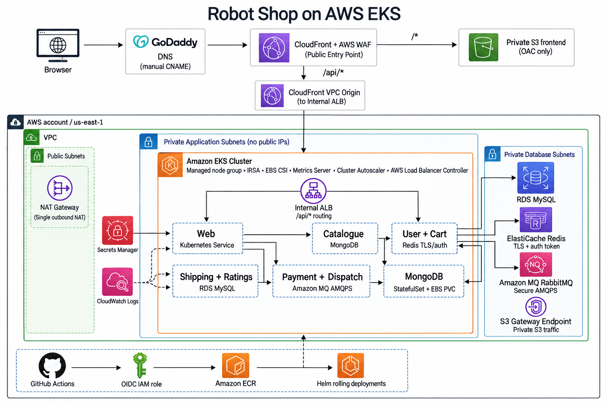
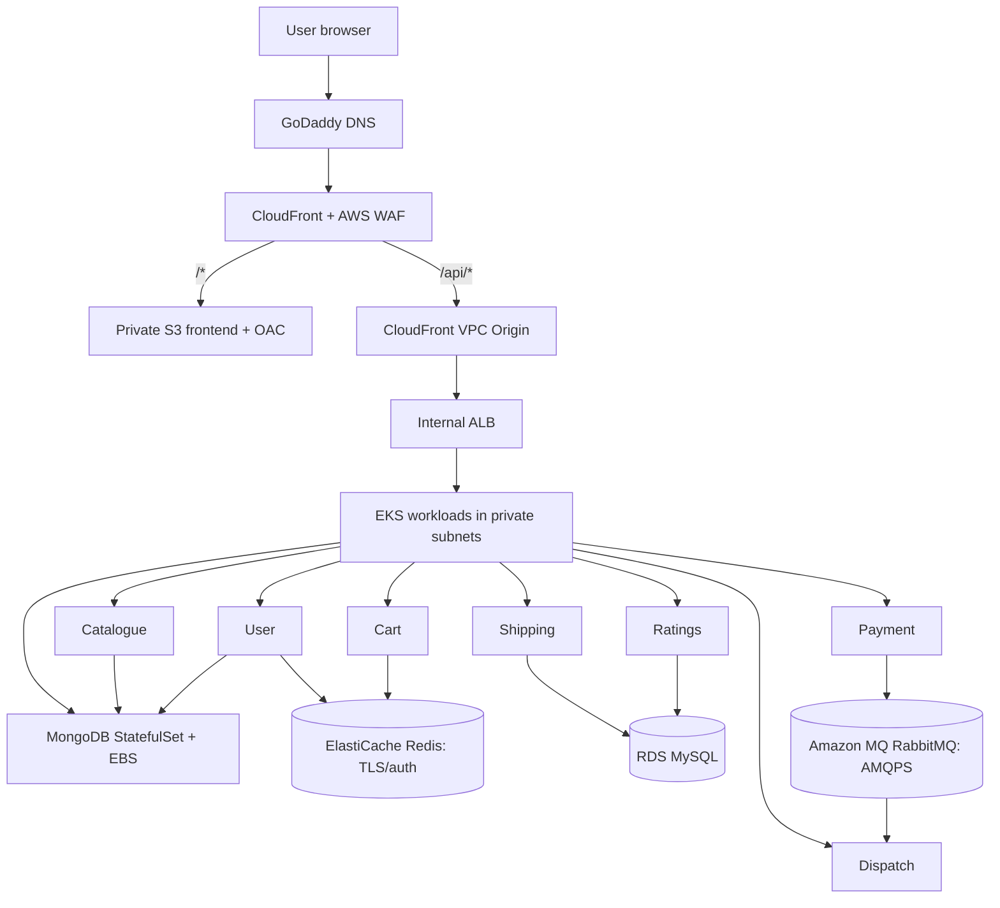

# Robot Shop on AWS EKS

<p align="center"><strong>A production-style deployment of Robot Shop microservices on AWS Kubernetes.</strong></p>

<p align="center">
  
  
  
  
</p>

Robot Shop is an e-commerce demonstration application built from independent microservices. This project deploys it on Amazon EKS with private workloads and data services, while CloudFront is the single public delivery layer.

## Architecture



## Application and traffic flow



## What this project demonstrates

| Public delivery | Private platform | Delivery pipeline |
| --- | --- | --- |
| GoDaddy DNS → CloudFront + WAF → S3 or private API origin | EKS, internal ALB, RDS, Redis, RabbitMQ, MongoDB | GitHub Actions → ECR → Helm → EKS |

- Eight Robot Shop workloads: web, catalogue, user, cart, shipping, ratings, payment, dispatch, and MongoDB.
- CloudFront serves the private S3 frontend through Origin Access Control (OAC); `/api/*` reaches an internal ALB through a CloudFront VPC origin.
- Kubernetes services communicate privately. MongoDB uses persistent EBS storage; MySQL, Redis, and RabbitMQ are AWS managed services.
- GitHub Actions uses OIDC rather than long-lived AWS keys. Service images use immutable Git commit SHA tags.

## Services

| Service | Responsibility | Main dependency |
| --- | --- | --- |
| Web | Static storefront | CloudFront/S3 |
| Catalogue | Product catalogue | MongoDB |
| User | User data | MongoDB, Redis |
| Cart | Shopping cart | Redis |
| Shipping | Shipping calculation | RDS MySQL |
| Ratings | Product ratings | RDS MySQL |
| Payment | Payment event producer | Amazon MQ RabbitMQ |
| Dispatch | Payment event consumer | Amazon MQ RabbitMQ |

## Start here

```text
terraform/  → creates the AWS platform
helm/       → deploys Robot Shop workloads to EKS
app/        → application source, Dockerfiles, and GitHub Actions workflow
```

| Directory | Purpose |
| --- | --- |
| [terraform/](terraform/README.md) | AWS network, EKS, data services, ECR, CloudFront, WAF, and IAM. |
| [app/](app/README.md) | Robot Shop source code and independent CI/CD workflow. |
| [helm/robot-shop/](helm/robot-shop/README.md) | Helm chart for Kubernetes workloads, services, ingress, HPA, and MongoDB storage. |
| [Architecture/](Architecture/) | Architecture assets used in this README. |
| [Screenshots/](Screenshots/) | Reserved for storefront screenshots. |

## Security and networking

- EKS nodes and application workloads run in private subnets.
- The ALB is internal; CloudFront is the public API entry point.
- S3 remains private and trusts only this CloudFront distribution through OAC.
- TLS is used at CloudFront with ACM. AWS WAF is associated with the distribution.
- RDS, ElastiCache Redis, and Amazon MQ accept traffic only from the EKS node security group. Redis uses TLS and authentication; RabbitMQ uses AMQPS.
- IAM Roles for Service Accounts (IRSA) provides the EBS CSI controller’s AWS access. GitHub Actions exchanges OIDC tokens for temporary AWS credentials.

## Application preview

Add storefront images to [Screenshots/](Screenshots/) and reference them here when available.

## Project flow

```text
Terraform apply → AWS platform ready → push app source → GitHub Actions detects changes
→ ECR receives SHA-tagged image → Helm upgrades only that service → EKS rolling update

Frontend change → GitHub Actions → private S3 sync → CloudFront invalidation
```

For infrastructure deployment, read the [Terraform guide](terraform/README.md). For application delivery and GitHub setup, read the [application guide](app/README.md).
